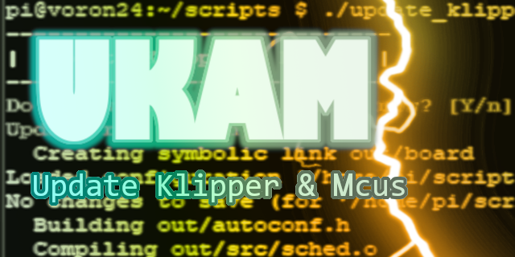

# update_klipper.sh : update Klipper and mcus all-at-once.



This is small bash script to update klipper and mcus (main, rpi, can, pico, ... ) and **keep trace of config file for the next update !**

# What it does ?
Update Klipper and apply firmware update for each mcu. Basically it runs:
```
git pull
service klipper stop
make clean
make menuconfig
make
<the_flash_command>
service klipper start
```

## Installation

>### WARNING ! 
>If you use a previous version of this script, copy the configuration files from ``~/klipper/`` to ``~/<script_folder>/config/``

### Method 1 :
Copy ``update_klipper.sh`` and ``mcus.ini`` in a folder of your pi, ``~/update_klipper_and_mcus/`` sounds as a good choice. Let's call this folder ``~/<script_folder>`` in this Readme.

Ensure to make ``update_klipper.sh`` executable : 
```
chmod +x ~/<script_folder>/update_klipper.sh
```
### Method 2 : 
```
cd ~
git clone https://github.com/fbeauKmi/update_klipper_and_mcus.git
```

Copy and edit ``mcus.ini`` from examples folder to ``~/update_klipper_and_mcus`/``

### Edit mcus.ini

mcus.ini contains : 
- sections : the name you give to your mcu between brackets
- action_command : command executed after the firmware build, whatever you need to prepare, flash or switch off/on the mcu. You can separate command by ``;`` or use several action_command in a section, they are executed in order of appearance.
- quiet_command : same as action_command but without stdout in QUIET mode 

The flash command depends on you mcus and the way you choose to flash your board : dfu-util, make flash, flashtool, flash_sdcard, mount/cp/umount ... refer to your board documentation to choose the right command

### mcus.ini examples (more to come) : 
```
# For Rpi
[RaspberryPi]
action_command: make flash
```
_source : [Klipper doc](https://www.klipper3d.org/RPi_microcontroller.html#building-the-micro-controller-code)_

```
# For a MCU in usart, using flash_sdcard
# The second arg of flash_sdcard.sh is the cpu reference.
# A list of available values can be found here :
# https://github.com/Klipper3d/klipper/blob/master/scripts/spi_flash/board_defs.py

[mcu]
flash_command: ./scripts/flash-sdcard.sh /dev/ttyAMA0 btt-octopus-f446-v1
```
_source : [Klipper doc](https://www.klipper3d.org/SDCard_Updates.html)_

```
# For a MCU in USB to Can bridge using Katapult as bootloader
# You have to insert your Canbus_uuid and Usb serial below
[mcu]
quiet_command: python3 ~/katapult/scripts/flashtool.py -i can0 -r -u <YOUR_CANBUS_UUID>; sleep 2
action_command: python3 ~/katapult/scripts/flashtool.py -d /dev/serial/by-id/usb-katapult_stm32f446xx_<BOARD_ID>-if00
```
_source : [Roguyt_prepare_command branch ^^](../roguyt_prepare_command/mcus.ini)_

```
# For Pico RP2040
[pico]
#  No boot loader, need to manually enter in boot mode
action_command : sudo mount /dev/sda1 /mnt ; sudo cp out/klipper.uf2 /mnt ; sudo umount /mnt

[pico_bootloader]
# With katapult as bootloader
action_command : make flash FLASH_DEVICE=/dev/serial/by-id/usb-Klipper_rp2040_<BOARD_ID>-if00
```
_source: Cannot remember_

## Usage

Run ``~/<script_folder>/update_klipper.sh`` in a terminal, you can use the following options.

### -h --help : to see usage

```
Usage: update_klipper.sh [<config_file>] [-h]

Klipper Firmware Updater script. Update Klipper repo and mcu firmwares

Optional args: <config_file> Specify the config file to use. Default is 'mcus.ini'
  -c, --checkonly            Check if Klipper is up-to-date only.
  -f, --firmware             Do not merge repo, update firmware only
  -q, --quiet                Quiet mode, proceed all if needed tasks, !SKIP MENUCONFIG! 
  -h, --help                 Display this help message and exit
```
### -c --checkonly
Check if Klipper is up-to-date, if not, it displays latest commits.
### -f --firmware : to force MCUs update
Skip Klipper update to repo or force Mcus update if Klipper is already up to date 
### -q --quiet : QUIET mode is Dangereous !

Quiet mode allows you to update all you configure without any interaction. Just run the script and all is done. But ....
- To use it, you need to run th script in interactive mode at least the first time.
- while features are modified/added/removed from menuconfig by klipper update, the config file is not updated. It may yield to a build issue.

## TODO
not to much, the script works. If you have any suggestions feel free to contact me on Voron discord @fboc
## Aknowledgments
Thanks to the Voron french community for supporting/tolerating me everyday ^^.